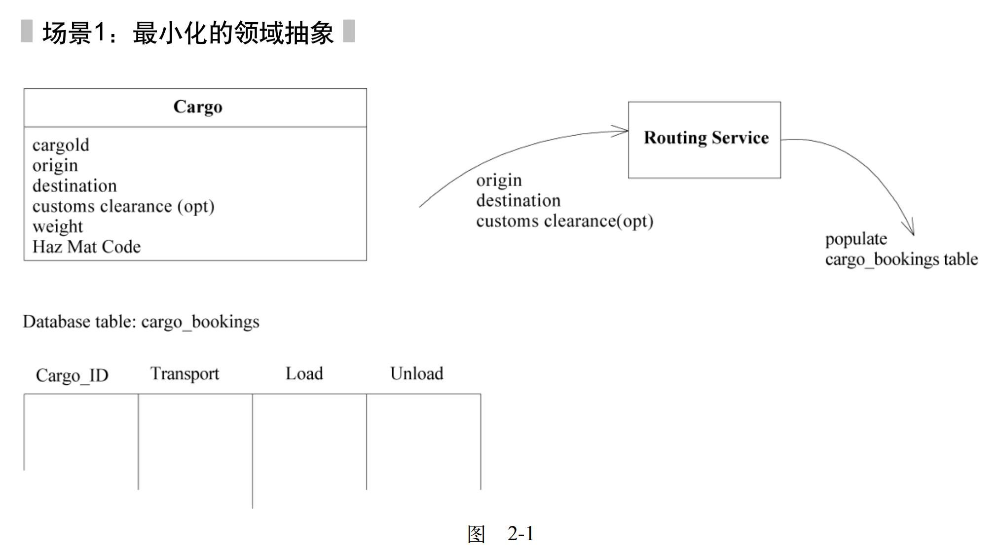
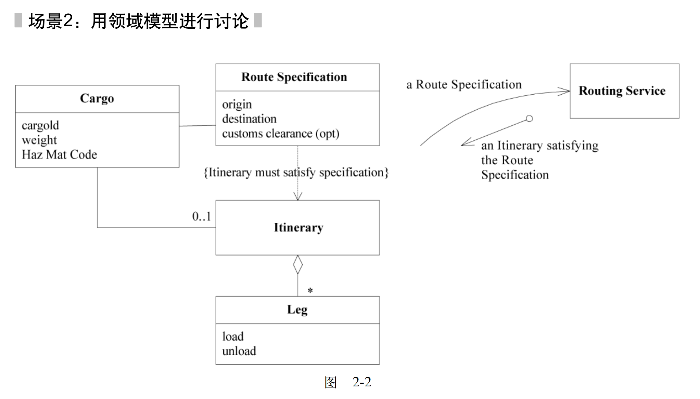
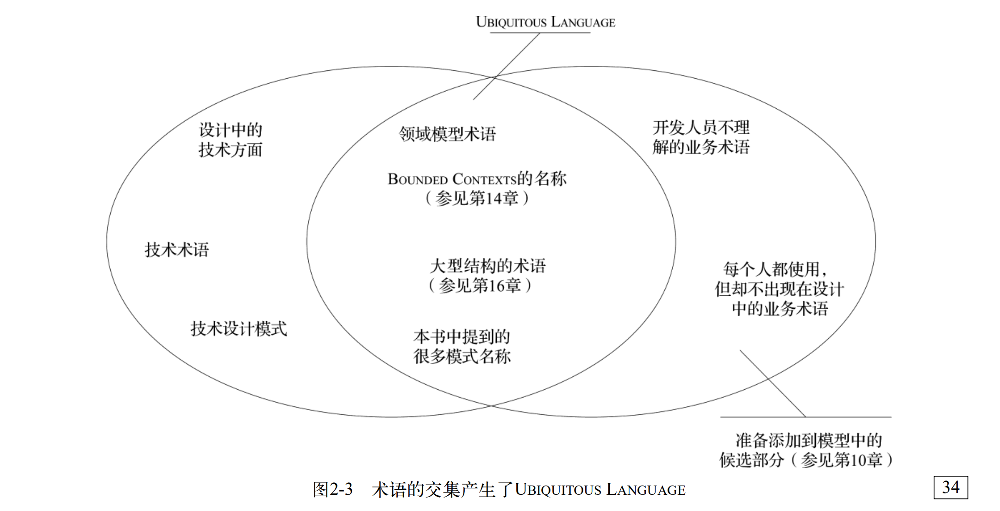
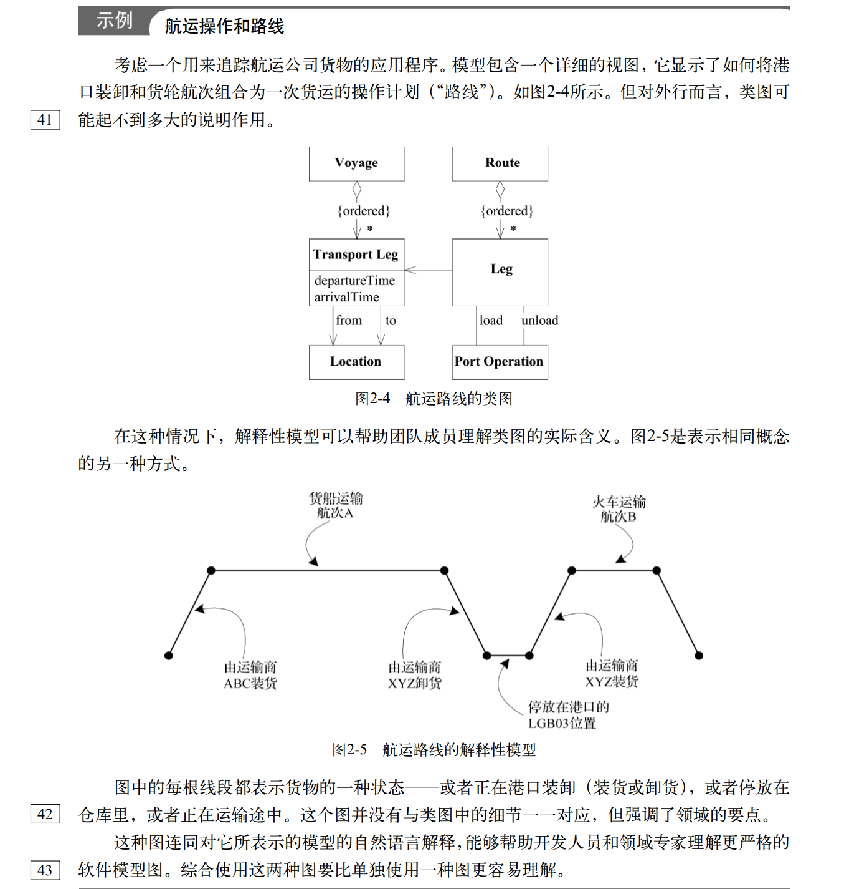

# DOMAIN-DRIVEN DESIGN

## 前言

### 设计过程与开发过程

敏捷开发，如极限编程，它将相当大的精力投入到促进沟通和提高项目快速变更能力的工作中，具有这种反应能力后，开发人员就可以在项目的任何阶段只利用 “最简单而管用的方案”，然后不断进行重构，一步一步做出小的设计改进，最终得到满足客户真正需要的设计。

但是，以上有关敏捷过程的思想可能会被误解，每个人对 ”最简单“ 都有不同的定义。持续重构其实是一系列小规模的重新设计，没有严格设计原则（设计知识）的开发人员将会创建出难以理解或修改的代码，这恰好与敏捷的精神相悖。而且，虽然对意外需求的担心常常导致过渡设计，但试图避免过度设计又可能走向另一个极端---不敢做任何深入地设计思考。

### 领域驱动团队

尽管开发人员个人能够从理解领域驱动设计中学到有价值的设计技术和观点，但最大的好处却是来自团队共同应用领域驱动设计方法，并且将领域模型作为项目沟通的核心，将敏捷开发（遵循严格设计原则的持续设计重构）作为项目编码的最佳实践。

这样，团队成员就有了一种公共语言，可以用来进行更充分的沟通，并确保围绕软件来进行沟通，他们将创建出一个与模型步调一致的清晰的实现，从而为应用程序的开发提供帮助。

所有人都了解不同团队的设计工作之间的联系，而且他们会一致将注意力集中在那些最组织最有价值、最与众不同的特性的开发商上。

## 第一部分 运用领域模型

### 第1章 消化知识

#### 1.1 有效建模的要素

* 模型和实现的绑定
* 建立了一种基于模型的语言
* 开发一个蕴含丰富知识的模型
* 提炼模型
* 头脑风暴和实验

#### 1.2 知识消化

有些项目使用了迭代过程，但由于没有对知识进行抽象而无法建立起知识体系。开发人员听专家描述某项所需的特性，然后开始构建它。他们把结果展示给专家，并询问接下来做什么。如果程序员愿意进行重构，则能够保持软件足够简洁，以便继续拓展它；但如果程序员对领域不感兴趣，则他们只会了解程序应该执行的过程，而不去了解它背后的原理。虽然这样也能开发出可用的软件，但项目永远也不会从原来特性中自然地拓展出强大的新特性。

在团队所有成员一起消化理解模型的过程中，他们之间的交互也会发生变化。领域模型的不断精化迫使开发人员学习重要的业务原理，而不是机械地进行功能的开发。领域专家被迫提炼自己知道的重要知识的过程往往也是完善其自身理解的过程，而且他们会渐渐理解软件项目所必需的概念严谨性。

模型在不断改进的同时，也成为组织项目信息流的工具。模型聚焦与需求分析，它与编程、设计紧密交互，它通过良性循环加深团队成员对领域的理解，使他们更透彻地理解模型，并对其进一步精化。

模型永远都不会是完美的，因为它是一个不断演进完善的过程。模型对理解领域必须是切实可用的，它们必须非常精确，以便使应用程序易于理解和实现。

#### 1.3 持续学习

看起来没有什么技术难度的领域很可能是一种错觉---我们并没有意识到不知道的东西究竟有多少。这种无知往往会导致我们做出错误的假设。

同时，所有项目都会丢失知识。已经学到了一些知识的人可能干别的事情去了，团队可能由于重组而被拆散，这导致知识又重新分散开，被外包出去的关键子系统可能只交回了代码，而不会将知识传递回来，而且使用典型的设计方法时，代码和文档不会以一种有用的形式表示出这些来之不易的知识，因此一旦由于某种原因人们没有口头传递知识，那么知识就丢失了。

#### 1.4 知识丰富的设计

通过模型获得的只是远远不只是 “发现名词”，业务活动和规则如同所涉及的实体一样，都是领域的核心。当我们建模不再局限于寻找实体和值对象时，我们才能够充分吸取知识，因为业务规则之间可能会存在不一致。

#### 1.5 深层模型

有用的模型很少停留在表面。随着对领域和应用程序需求的理解逐步加深，我们往往会丢弃那些最初看起来很重要的表面元素，或者切换它们的角度，这时，一些开始时不可能发现的巧妙抽象就会渐渐浮出水面，而它们恰恰切中问题的要害。

以书中集装箱航运项目为例，在这个项目中，由于航运从预订货运开始，因此我们开发了一个能够描述货物和运货航线等事物的模型这是必要且有用的，但领域专家却不买账，他们有自己的考虑业务的方式，这种方式是我们没有考虑到的。

在经过几个月的知识消化后，我们知道货物的处理主要是由转包商或公司中的操作人原完成的，这包括实际的装货、运货和卸货。航运专家的观点是，各部分之间存在一系列的责任传递，法律责任和执行责任的传递由一个过程控制---从托运人传递到某个本地运输商，再从这个运输商传递到另一家运输商，最后到达收货人。

对航运业务有了更深刻的认识后，我们并没有删除 Itinerary（航线）对象，但模型发生了巨大改变，我们对航运业务的认识从 ”集装箱在各个地点之间的运输“ 转变为 ”运货责任在各个实体之间的传递“，处理这些责任传递的特性不再是一些附属于装货作业的次要特性，而是由一个独立的模型来提供支持，这个模型正是在理解了作业与责任之间的重要关系之后开发出来的。

**知识消化是一种探索，它永无止境**

### 第2章 交流与语言的使用

#### 2.1 模式：通用语言（ubiquitous language）



```
用户：那么，当更改清关（customs clearance）地点时，需要重新制定整个路线计划啰？
开发人员：是的。我们将从货运表（shipment table）中删除所有与该货物id相关联的行，然后将出发地、目的地和新的清关地点传递给RoutingService，它会重新填充货运表。Cargo中必须设置一个布尔值，用于指示货运表中是否有数据。
用户：删除行？好，就按你说的做。但是，如果先前根本没有指定清关地点，也需要这么做吗？
开发人员：是的，无论何时更改了出发地、目的地或清关地点（或者第一次输入），都将检查是否已经有货运数据，如果有，则删除它们，然后由RoutingService重新生成数据。
用户：当然，如果原有的清关数据彭票是正确的，我们就不需要这样做了。
开发人员：哦，没问题，但让RoutingService每次重新加载或卸载数据会更容易些。
用户：是的，但为新航线制定所有的支持计划的工作量很大，因此，除了非改不可，我们一般不想更改航线。
开发人员：哦，好的，当第一次输入清关地点时，我们需要查询表格，找到以前的清关地点，然后与新清关地点进行比较，从而判断是否需要重做。
用户：这个处理不需要考虑出发地和目的地，因为航线在此总要变更。
开发人员：好的，我明白了。
```

　

```
用户：那么，当更改清关地点时，需要重新制定整个路线计划啰。
开发人员：是的，当更改Route Specification（路线说明）的任意属性时，都将删除原有的Itinerary（航线），并要求RoutingService（路线服务）基于新的RouteSpecification生成一个新的Itinerary。
用户：如果先前更没有指定清关地点，也需要这么做吗？
开发人员：是的，无论何时更改了Route Specification的任何属性，都将重新生成Itinerary，这也包括第一次输入某些属性。
用户：当然，如果原有的清关数据碰巧是正确的，我们就不需要这样做了。
开发人员：哦，没问题，但让RoutingService每次重新生成一个itinerary会更容易些。
用户：是的，但为新航线制定所有的支持计划的工作量很大，因此，除非非改不可，我们一般不想更改路线。
开发人员：哦，那么需要在RouteSpecification添加一些功能。这样，当更改其中的属性时，查看itinerary是否仍满足specification，如果不满足，则需要由RoutingService重新生成itinerary。
用户：这一点不必考虑出发点和目的地，因为itinerary在此总是要变化的。
开发人员：好的，但每次只做比较就简单多了。只有当不满足RouteSpecification时，才重新生成itinerary。
```

第二段对话表达了领域专家的更多意图，在这两段对话中，用户都使用了 itinerary 航线 这个词，但在第二段中它是一个对象，这使得双方可以更准确、具体地进行讨论。他们明确讨论了 route specification，而不是每次都通过属性和过程来描述它。

这两段对话都有意使用了相似的结构，实际上，第一段对话显得更啰嗦，对话双方需要不断对应用程序的特性和表达不清的地方进行解释，第二段对话使用了基于领域模型的术语，因此讨论更简洁。

要想创建一种灵活的、蕴含丰富知识的设计，需要一种通用的、共享的团队语言，以及对语言不断地试验。

如果语言支离破碎，项目必将遭遇严重问题。领域专家使用他们自己的术语，而技术团队所使用的语言则经过调整，以便从设计角度讨论领域。

日常讨论所使用的术语和代码（软件项目的最重要产品）中使用的术语不一致，甚至同一个人在讲话和写东西时使用的语言也不一致，这导致的后果是，对领域的深刻表述常常稍纵即逝，根本无法记录到代码或文档中。

ubiquitous language（通用语言）的词汇包括类和主要操作的名称，语言中的术语，有些用来讨论模型中已经明确的规则，还有一些则来自施加于模型上的高级组织原则（如context map和大型结构），最后，团队常常应用于领域模型的模式名称也使这种语言更为丰富。

开发人员应该使用基于模型的语言来描述系统中的工件、任务和功能，这个模型应该为开发人员和领域专家提供一种用户相互交流的语言，而且领域专家还应该使用这种语言来讨论需求、开发计划和特性。语言使用得越普遍，理解进行得就越顺畅。

至少，我们应该将它作为目标，但最初，模型可能不太友好，因此无法很好地履行上述职责，它可能不会像领域的专业术语那样具有丰富的语义，但我们又不能直接使用那些术语，因为它们有歧义和矛盾。模型可能缺乏开发人员在代码中所创建的更为微秒和灵活的特性，这要么是因为开发人员认为模型不必具备这些特性，要么是因为编码风格是过程式的，只能隐含地表达领域概念。

因此：

**将模型作为语言的支柱，确保团队在内部所有的交流中以及代码中坚持使用这种语言，在画图、写东西，特别是讲话时也要使用这种语言。**

**通过尝试不同的表示方法（它们反映了备选模型）来消除难点，然后重构代码，重新命名类、方法和模块，以便与新模型保持一致，解决交谈中的术语混淆问题，就像我们对普通词汇形成一致的理解一样。**

**要认识到，ubiquitous language的更改就是对模型的更改。**

**领域专家应该抵制不合适或无法充分表达领域理解的术语或结构，开发人员应该密切关注那些将会妨碍设计的有歧义和不一致的地方。**

有了通用语言，模型就不仅仅是一个设计工件了，它成为开发人员和领域专家共同完成的每项工作中不可或缺的部分，语言以动态形式传递知识，使用这种语言进行讨论能够呈现图和代码背后的真实含义。

#### 2.2 大声地建模

改善模型的最佳方式之一就是通过对话来进行研究，试着大声说出可能的模型变化中的各种结构，这样不完善的地方很容易被听出来。

```
"如果我们向RoutingService提供出发地、目的地和到达时间，就可以查询货物的停靠地点，嗯...将它们存到数据库中"（含糊且偏重于技术）

"出发地、目的地...把它们都输入到RoutingService中，而后我们得到一个itinerary，它包活我们所需的全部信息"（更具体，但过于啰嗦）

"RoutingService查找满足RouteSpecification的itine"（简洁）
```

使用单词和短语是极为重要的---其将我们的语言能力用于建模工作，这就如同素描对于表现视觉和空间推理十分重要一样，我们既要利用系统性分析和设计方面的分析能力，也要利用对代码的神秘 ”感觉“。这些思考方式互为补充，要充分利用它们来找到有用的模型和设计。在所有这些方式中，语言上的试验常常是最容易被忽视的。

当我们在讨论中使用领域模型的通用语言时，特别是在开发人员和领域专家一起推敲场景和需求时，通用语言的使用会越来越流利，而且我们还可以互相指点一些细微的差别。我们自然而然的共享了我们所说的语言，而这种方式是图和文档无法做到的。

想要在软件项目上产生一种通用语言，说起来容易，做起来难，我们必须充分利用自然赋予我们的才能来实现这个目标。正如人类的视觉和空间思维能力使我们能够快速传达和处理图形概述中的信息一样，我们也可以利用自己在基于语法的、有意义的语言方面的天赋来推动模型的开发。

因此，下面这段话可以作为通用语言模式的补充：

**讨论系统时要结合模型，使用模型元素及其交互方式来大声描述场景，并且按照模型允许的方式将各种概念结合到一起，找到更简单的表达方式来讲出你要讲的话，然后将这些新的想法应用到图和代码中**

#### 2.3 一个团队，一种语言

技术人员通常认为业务专家最好不要接触领域模型，他们认为：

” 领域模型对他们来说太抽象了 “

” 他们不理解对象 “

” 这样我们就不得不用他们的术语来搜集需求 “

上面只是列举了一些从一个使用两种语言的团队中听到的少数几个原因。忘掉它们吧。

当然，设计中一些技术组件与领域专家无关，但模型的核心最好还是让他们参与。过于抽象？那你怎么知道抽象是否合理？你是否像他们一样深入理解领域？有时，某些特定需求是从底层用户那里收集的，他们描述这些需求时可能会用到一小部分更具体的术语，但领域专家应该能够更深入地思考他们所从事的领域。如果连经验丰富的领域专家都不能理解模型，那么模型一定出了什么问题。

当领域专家使用这种语言互相讨论，或者与开发人员进行讨论时，很快就会发现模型中哪些地方不符合他们的需要，甚至是错误的。另一方面，模型语言的准确性也会促使领域专家（在开发人员的帮助下）发现他们想法中的矛盾和含糊之处。



有了通用语言之后，开发人员之间的对话、领域专家之间的讨论以及代码本身所表达的内容都基于同一种语言，都来自于一个共享的领域模型。

#### 2.4 文档和图

图是一种沟通和解释的手段，它们可以促进头脑风暴。简洁的小图能够很好地实现这些目标，而涵盖整个对象的综合性大图反而失去了沟通或解释的能力，因为它们将读者淹没在大量细节之中，加之这些图也缺乏目的性。鉴于此，我们应避免使用包罗万象的对象模型图，甚至不能使用包含所有细节的UML数据存储库。相反，应使用简化的图，图中只包含对象模型的重要概念---这些部分对于理解设计至关重要。

***设计的重要细节应该在代码中体现出来***。良好的实现应该是透明的，清楚地展示其背后的模型。互为补充的图和文档能够引导人们将注意力放在其核心点上。自然语言的讨论可以填补含义上的细微差别。这就是作者为什么喜欢把典型的UML使用方法颠倒过来的原因。通常的用法是以图为主，辅以文本注释；而作者更愿意以文本为主，用精心挑选的简化图作为说明。

务必记住***模型不是图***。图的目的是帮助表达和解释模型，代码可以充当设计细节的存储库。书写良好的代码与UML具有同样的表达能力，经过仔细选择和构造的图可以帮助人们集中注意力，并起到指导作用，当然前提条件是不能强制用图来表示全部模型或设计，因为这样会削弱图的清晰表达的能力。

##### 2.4.1 书面设计文档

书面文档有很多编写方法，作者给出了两条用于评估文档的总体原则。

**文档应作为代码和口头交流的补充**

每种敏捷过程在编写文档方面都有自己的理念。极限编程主张完全不使用（多余的）设计文档，而让代码解释自己。实际运行的代码不会说谎，而其他文档则不然。运行代码所产生的行为是明确地。

然而，将代码作为设计文档也有局限性。它可能会把读代码的人淹没在细节中。尽管代码的行为是非常明确的，但这并不意味着其行为是显而易见的，而且行为背后的意义可能难以表达。换言之，只用代码做文档和使用大而全的UML图面临着差不多相同的基本问题。当然，团队进行大量的口头交流能够为代码提供上下文和指导，但是，口头交流很短暂，而且范围很小。此外，开发人员并不是唯一需要理解模型的人。

***文档不应再重复表示代码已经明确表达出的内容。***代码已经含有各个细节，它本身就是一种精确的程序行为说明。

其他文档应该着重说明含义，以便使人们能够深入理解大尺度结构，并将注意力集中在核心元素上。当编程语言无法直接明了地实现概念时，文档可以澄清设计意图。我们应该把书面文档作为代码和口头讨论的补充。

**文档应当鲜活并保持最新**

作者在为模型编写书面文档时，会仔细选择一个小的模型子集来画图，然后让文字放置在这些图周围。作者用文字定义类及其职责，并且像自然语言那样将它们限定在一个语义上下文中，而图显示了在将概念形式化和简化为对象模型的过程中所做的一些选择，这些图可以随意一些，甚至是手绘的，手绘图除了节省工作量，也让人们一看就知道它们是不正式、临时的。这些优点都非常有利于交流，因为它们适用于我们的模型思想。

设计文档最大的价值在于解释模型的概念，帮助在代码的细节中指引方向，或许还可以帮助人们深入了解模型预期的使用风格。根据不同的团队理念，整个设计文档可能会十分简单，如只是贴在墙上的一组草图，也可能会非常详尽。

***文档必须深入到各种项目活动中去。***判断是否做到这一点的最简单方法，是观察文档与通用语言之间的交互。文档是用人们（当前）在项目上讲的语言编写的吗？它是用嵌入到代码中的语言编写的吗？

##### 2.4.2 完全依赖可执行代码的情况

虽然代码可能会产生误导，但它仍然比其他文档更基础。要想利用当前的标准技术使代码所传达的消息与它的行为和意图保持一致，需要纪律和思考设计的特定方式。要有效地交流，代码必须基于在编写需求时所使用的同一种语言，也就是开发人员之间、开发人员与领域专家之间进行讨论时所使用的语言。

#### 2.5 解释性模型

本书的核心思想是在实现、设计和团队交流中使用同一个模型作为基础。如果各有各的模型，将会造成危害。

使用其他模型的一个特殊原因是范围。驱动软件开发过程的技术模型必须经过严格的精简，以便用最小化的模型来实现其功能。而解释性模型则可以包含那些提供上下文的领域方面---这些上下文用于澄清范围更窄的模型。

解释性模型提供了一定的自由度，可以专门为某个特殊主题定制一些表达力更强的风格。领域专家在一个领域中所使用的视觉隐喻通常呈现了更清晰的解释，这可以教给开发人员领域知识，同时使领域专家们的意见更一致。解释性模型还可以以一种不同的方式来呈现领域，并且各种不同角度的解释有助于人们更好地学习。

解释性模型不必是对象模型，而且最好不是。实际上在这些模型中不使用UML是有好处的，这样可以避免人们错误地认为这些模型是与软件设计是一致的。尽管解释性模型与驱动设计的模型往往有对应关系，但它们并不完全类似。为了避免混淆，每个人都必须知道它们之间的区别。



### 第3章 绑定模型与实现

如果一个项目虽然建立了领域模型，但是如果模型不能直接帮助开发可运行的软件，那么这种纸上谈兵的模型又有什么意义呢？

#### 3.1 模式 MODEL-DRIVEN DESIGN

严格按照基础模型来编写代码，能够使代码更好地表达设计含义，并且使模型与实际的系统相契合。

那些压根没有领域模型的项目，仅仅通过编写代码来实现一个又一个的功能，它们无法利用前两章所讨论的知识消化和沟通所带来的好处。如果涉及复杂的领域就会使项目举步维艰。

另一方面，许多复杂项目确实在尝试使用某种形式的领域模型，但是并没有把代码的编写与模型紧密联系起来。这些项目所设计的模型，在项目初期还可能用来做一些探索工作，但是随着项目的进展，这些模型与项目渐行渐远，甚至还会起误导作用。所有在模型上花费的精力都无法保证程序设计的正确性，因为模型和设计师不同的。

无论是什么原因，软件的设计如果缺乏概念，那么软件充其量不过是一种机械化的产品---只实现有用的功能缺无法解释操作的原因。

**如果整个程序设计或者其核心部分没有与领域模型相对应，那么这个模型就是没有价值的，软件的正确性也值得怀疑，同时，模型和设计功能之间过于复杂的对应关系也是难于理解的，在实际项目中，当设计改变时也无法维护这种关系。若分析和设计之间产生严重分歧，那么在分析和设计活动中所获得的知识就无法彼此共享。**

分析工作一定要抓住领域内的基础概念，并且有易于理解和易于表达的方法描述出来。设计工作则需要指定一套可以由项目中使用的编程工具创建的组件，使项目可以在目标部署环境中高效运行，并且能够正确解决应用程序所遇到的问题。

model-driven design 不再将分析模型和程序设计分离开来，而是寻求一种能够满足这两方面需求的单一模型。不考虑纯粹的技术问题，程序设计中每个对象都反映了模型中所描述的相应概念。这就要求我们以更高的标准来选择模型，因为它必须同时满足两种完全不同的目标。

有很多方法可以对领域进行抽象，也有很多设计可以解决应用程序的问题。因此，绑定模型和程序设计是切实可行的，但是这种绑定不能够因为技术考虑而削弱分析的功能，我们也不能接受那些只反映了领域概念缺舍弃了软件设计原则的拙劣设计。模型和设计的绑定需要的是在分析和程序设计阶段都能发挥良好作用的模型。如果模型对于程序的实现来说太不实用时，我们必须重新设计它，而如果模型无法忠实地描述领域的关键概念，也必须重新设计它。这样，建模和程序设计就结合为一个统一的迭代开发过程。

**软件系统各个部分的设计应该忠实的反应领域模型，以便体现出这二者之间的明确对应关系。我们应该反复检查并修改模型，以便软件可以更加自然地实现模型，即使想让模型反映出更深层次的领域概念时也应如此。我们需要的模型不但应该满足这两种需求，还应该能够支持健壮的 通用语言。**

**从模型中获取用于程序设计和基本职责分配的术语，让程序代码成为模型的表达，代码的改变可能会是模型的改变，而其影响势必要波及接下来相应的项目活动。**

**完全依赖模型的实现通常需要支持建模范式的软件开发工具和语言，比如面向对象的编程。**

#### 3.2 建模范式和工具支持

为了使model-driven design 发挥作用，一定要在可控范围内严格保证模型与设计之间的一致性。要实现这种严格的一致性，必须要运用由软件工具支持的建模范式，它可以在程序中直接创建模型中的对应概念。

面向对象之所以功能强大，是因为它基于建模范式，并且为模型构造提供了实现方式。从程序员的角度来看，对象真实存在于内存中，它们与其他对象相互联系，它们被组织成类，并且通过消息传递来完成相应的行为。许多开发人员知识得益于对象的技术能力---用起组织程序代码。只有用代码表达模型概念时，对象设计的真正突破之处才彰显出来。

大部分非数学领域都不适合用过程语言来进行 model-driven design，因为这些领域无法被抽象铖数学函数或者过程中的操作步骤。

#### 3.3 揭示主旨：为什么模型对于用户至关重要


#### 3.4 模式：hands-on modeler

人们总是将软件开发比喻成制造业。这个比喻的一个推论是：经验丰富的工程师做设计工作，而技能水平低的劳动力负责组装产品。这种做法使许多项目陷入困境，原因很简单---软件开发就是设计。虽然开发团队中的每个成员都有自己的职责，但是将分析、建模、设计和编程工作过度分离会对model-driven design产生不良影响。

**如果编写代码的人员认为自己没有必要对模型负责，或者不知道如何让模型为应用程序服务，那么这个模型就和程序没有任何关联。如果开发人员没有意识到改变代码就意味着改变模型，那么他们对程序的重构不但不会增强模型的作用，反而还会削弱它的效果。同样，如果建模人员不参与到程序实现的过程中，那么对程序实现的约束就没有切身的感受，即使有，也会很快忘记。 model-driven design的两个基本要素（即模型支持有效的实现并抽象出关键的领域知识）已经失去了一个，最终模型将变得不再可用。最后一点，如果分工阻断了设计人员和开发人员之间的协作，使他们无法转达实现model-driven design的种种细节，那么经验丰富的设计人员则不能将自己的知识和技术传递给开发人员。**

hands-on model（亲身实践爱的建模者）并不意味着团队成员不能有自己的专业角色，包括极限编程在内的每一种敏捷过程都会给团队成员分配角色，其他非正式的专业角色也会自然而然地产生，但是如果把model-driven design中密切相关的建模和实现这两个过程分离开，则会产生问题。

因此：

**任何参与建模的技术人员，不管在项目中的主要职责是什么，都必须花时间了解代码。任何负责修改代码的人员则必须学会用代码来表达模型。每一个开发人员都必须不同程度地参与模型讨论并且与领域专家保持联系，参与不同工作的人都必须有意识地通过 通用语言 与接触代码的人及时交换关于模型的想法。**

model-driven design利用模型来为应用程序解决问题。项目组通过知识消化将大量杂乱无章的信息提炼成实用的模型，而model-driven design将模型和程序实现过程紧密结合，ubiquitous language 则成为开发人员、领域专家和软件产品之间传递信息的渠道/语言。

## 第二部分 模型驱动设计的构造块

下面这张图是一张导航图，它描述的是本部分所要讲解的模型以及这些模式彼此关联的方式。

共用这些标准模式可以使设计有序进行，也使项目成员能够更方便地了解彼此的工作内容，同时，使用标准模式也使 ubiquitous language更加丰富，所有的项目成员都可以使用ubiquitous language来讨论模型和设计决策。

### 第4章 分离领域

在软件中，虽然专门用于解决领域问题的那部分通常只占整个软件系统的很小一部分，但其却出乎意料的重要。要想实现本书的想法，我们需要着眼于模型中的元素并且将它们视为一个系统，绝不能像在夜空中辨认星座一样，被迫从一大堆混杂的对象中将领域对象挑选出来。我们需要将领域对象与系统中的其他功能分离，这样就能够避免将领域概念和其他只与软件技术相关的概念搞混了，也不会在纷繁芜杂的系统中完全迷失了领域。

#### 4.1 模式：layered architecture

**如果与领域有关的代码分散在大量的其他代码之中，那么查看和分析领域代码就会变得异常困难。对用户界面的简单修改实际上很可能会改变业务逻辑，而想要调整业务规则也很可能需要对用户界面代码、数据库操作代码或者其他的程序元素进行仔细的筛查。这样就不太可能实现一致的、模型驱动的对象了，同时也会给自动化测试带来困难，考虑到程序中哥哥活动所涉及的大量逻辑和技术，程序本身必须简单明了，否则就会让人无法理解。**

要想创建出能够处理复杂任务的程序，需要做到关注点分离---使设计中的每个部分都得到单独的关注，在分离的同时，也需要维持系统内部复杂的交互关系。

软件系统有各种各样的划分方式，但是根据软件行业的经验和惯例，普遍采用layered architecture（分层架构），特别是有几个层基本上已成了标准。分层这汇总隐喻被广泛采用，大多数开发人员都对其有着直观的认识。分层架构的基本原则是层中的任何元素都仅依赖于本层的其他元素或其下层的元素，向上的通信必须通过间接的方式进行，这些将在后面讨论。

分层的价值在于每一层都只代表程序中的某一特定方面，这种限制使每个方面的设计都更具有内聚性，更容易解释。当然，要分离出内聚设计中最重要的方面，选择恰当的分层方式是至关重要的。在这里，经验和惯例又一次为我们指明了方向，尽管分层架构的种类繁多，但是大多数成功的架构使用的都是下面这4个概念层的某种变体。

* 用户界面层（或者表示层）：负责向用户显示信息和解释用户指令，这里指的用户是可以是另一个计算机系统，不一定是使用用户界面的人。
* 应用层：定义软件要完成的任务，并且指挥表达领域概念的对象来解决问题。这一层所负责的工作对业务来说意义重大，也是与其他系统的应用层进行交互的必要渠道。
* 领域层（模型层）：负责表达业务概念，业务状态信息以及业务规则。尽管保存业务状态的技术细节是由基础设施层实现的，但是反映业务情况的状态是由本层控制并使用的。***凌宇曾是业务软件的核心***。
* 基础设施层：为上面各层提供通用的技术能力：为应用层传递消息，为领域层提供持久化机制，为用户界面层绘制屏幕组件，等等。基础设施层还能够通过架构框架来支持4个层次间的交互模式。

有些项目没有明显划分出用户界面层和应用层，而有些项目有多个基础设施层。但是将领域层分离出来才是实现model-driven design的关键。

因此：

**给复杂的应用程序划分层次，在每一层内分别进行设计，使其具有内聚性并且只依赖于它的下层。采用标准的架构模式，只与上层进行松散的耦合。将所有与领域相关的代码放在一个层中，并把它与用户界面层、应用层以及基础设施层的代码分开。领域对象应该将重点放在如何表达领域模型上，而不需要考虑自己的显示和存储问题，也无需管理应用任务等内容。这使得模型的含义足够丰富，结构足够清晰，嗯可以捕捉到基本的业务知识，并有效地使用这些知识。**

##### 4.1.1 将各层关联起来

到目前为止，我们的讨论主要集中在层次划分以及如何分层才能改进程序各个方面的设计上，特别是集中在领域层上。但是显然，各层之间也需要相互连接，在连接各层的同时不影响分离带来的好处，这是很多模式的目的所在。

各层之间是松散的，层与层的依赖关系只能是单向的，上层可以直接使用或操作下层元素，方法是通过调用下层元素的公共接口，保持对下层元素的引用（至少是暂时的），以及采用常规的交互手段。而如果下层元素需要与上层元素进行通信（不只是回应直接查询），则需要采用另一种通信机制，使用架构模式来连接上下层，如回调模式或observers（观察者）模式。

最早将用户界面与应用层和领域层相连的模式是MVC模式，它是为Smalltalk语言发明的一种设计模式，创建于20世纪70年代。随后出现的许多用户界面结构都是受到它的启发而产生的。Fowler在【Folwer2002】中讨论了这种模式以及几个实用的实体。Larman也在MVC模式中探讨了这些问题，他提出的application coordinator（应用协调器）是链接应用层的一种方法。

还有许多其他连接用户界面层和应用层的方式，对我们而言，只要连接方式能够维持领域层的独立性，保证在设计领域对象时不需要同时考虑可能与其交互的用户界面，那么这些连接方式就都是可用的。

通常，基础设施层不会发起领域层中的操作，它处于领域层“之下”，不包含其所服务的领域中的知识。事实上这种技术能力最常以service的形式提供。例如，如果一个应用程序需要发送电子邮件，那么一些消息发送接口就可以放在基础设施中，这样，应用层中的元素就可以请求发送消息了。这种解耦使程序的功能更加丰富。消息发送接口可以连接到电子邮件发送服务、传真发送服务或任何其他可用的服务。但是这种方式 最主要的好处是简化了应用层，使其只专注于自己做所负责的工作：知道何时该发送消息，而不操心怎么发送。

应用层和领域层可以调用基础设施层所提供的service，如果service的范围选择合理，接口设计完善，那么通过把详细行为封装到服务接口中，调用程序就可以保持与service的松散连接，并且自身也会很简单。

**然而，并不是所有的基础设施都是以供上层调用的service的形式出现的。有些技术组件被设计成直接支持其他层的基本功能（如为所有的领域对象提供抽象基类），并且提供关联机制（如MVC及类似框架的实现）。这种 ”架构框架“对于程序其他部分的设计有着更大的影响。**

##### 4.1.2 架构框架

如果基础设施通过接口调用service的形式来实现，那么如何分层以及如何保持层与层之间的松散连接就是相当显而易见的。但是有些技术问题要求更具侵入性的基础设施，整合了大量基础设施需求的框架通常会要求其他层以某种特定的方式实现，如以框架类的子类形式或者带有结构化的方法签名。（子类在父类的上层似乎是违反常理的，但是要记住哪个类反映了另一个类的更多知识。）最好的架构框架既能解决复杂技术问题，也能让领域开发人员集中精力去表达模型，而不考虑其他问题。然而使用框架很容易为项目制造障碍：要么是设定了太多的假设，减小了领域设计的可选范围；要么是需要实现太多的东西，影响开发进度。

#### 4.2 领域层是模型的精髓

现在，大部分软件系统都采用了分层架构，只是采用的分层方案存在不同而已，许多类型的开发工作都能从分层中受益。然而，领域驱动设计只需要一个特定的层存在即可。

领域模型是一系列概念的集合，“领域层”则是领域模型以及所有与其有直接相关的设计元素的表现，它有业务逻辑的设计和实现组成。在领域驱动设计中，领域层的软件架构反映出了模型概念。

如果领域逻辑与程序中的其他关注点混在一起，就不可能实现这种一致性。将领域实现独立出来是领域驱动设计的前提。

#### 4.3 模式：the smart ui 反模式

#### 4.4  其他分离模式

遗憾的是，除了基础设施和用户界面之外，还有一些其他因素也会破坏你精心设计的领域模型。你必须要考虑那么完全没有集成到模型中的领域元素，你不得不与同一个模型中使用不同模型的其他开发团队合作。还有其他的因素会让你的模型结构不再清晰，并且影响模型的使用效率。在第14章中会讨论这方面的问题，同时会介绍其他模式，如bounded context和anti corruption layer。非常复杂的领域模型本身是难以使用的，所以，第15章将会说明如何在领域层内进行进一步区分，以便从次要细节中突显出领域的核心概念。

### 第5章


